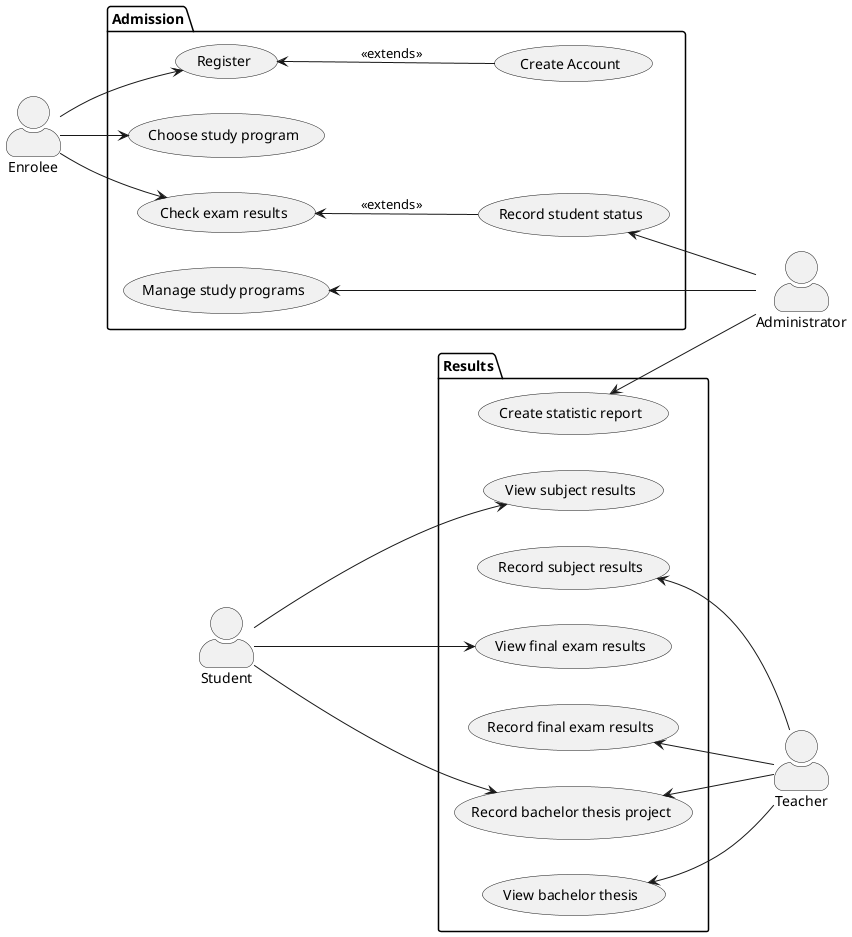

# Student information system - Students
  The Students Module handles admission into the university and grading of subjects, final exams and bachelor theses.

## Functional Requirements

### User requirements

1. A person shall be able to create a new application for the university and recieve credentials of his new account.
2. An enrolee should be able to choose his admision exam and study program.
3. An administartor shall be able to manage study programs.
4. An enrolee should be able to check the results of his admission exam.
5. A student should be able to accept or decline his place at the university.
6. An administartor should be able to record the status of the student at enrollment. 
7. An administartor should be able to create statistic reports.
8. A teacher shall be able to record the subject results of students. 
9. A student should be able to see his own results at a certain subject.
10. A teacher shall be able to record the results of the final exams taken by students.
11. A student shall be able see his result at the final exam.
12. A teacher shall be able to record the subject of the bachelor theses of students.
13. A student should be able to record his bachelor thesis project.
14. A teacher shall be able to view the bachelor theses of students.

### System requirements

#### Actors

##### Enrolee

  The Enrolee applies to the university and recieves credentials for his new account. Using the account, he can choose the study program he wants to apply for and recieves the date and place of the admission exam. After taking the exam, he will be able to view his results and choose whether to enroll to the university or to decline his place. 

##### Student

The Student can view his results at subjects and final exams given by teachers. He can also record his bachelor thesis project and view the grade for it which is recorded by another teacher.

##### Administrator

The Administartor manages the study programs of the university and records the status of a student (if he accepted/declined his place before/after the deadline). He creates statisticals reports on the student success rate in each year.

##### Teacher

The Teacher records the grading for his subjects and for the final exams taken by students. He can record the subject of the bachelor theses of the students he mentors and he can view their bachelor thesis projects.

#### Use cases

##### Register

###### Starting situation
  The enrolee wants to apply for a place at the university. 

###### Normal
1. The enrolee completes the form containing his personal information: first and last name, birth date, personal identification number, email, phone number and address.
2.  The Student Management System checks if all mandatory fields are filled in.
3. The Student Management System checks if the format of the birth date, personal idntification number, email and phone number are valid.
4. The form containing the personal data of the enrolee is submitted to the system.
5. The enrolee is notified upon his successful registration. 

###### What can go wrong
1. Not all the mandatory fields in the form are filled in by the enrolee. In this case, the enrolee must complete all of them.
2. The format of the filled in fields is not valid.In this case, the submitting of the form is rejected and the enrolee is notified and has to refill them correctly.

###### System state on completion
1. A valid form containg the personal data of the enrolee is submitted and registered in the system.
2. Non-valid filled forms are rejected and the enrolee is notified about the error.

###### Test case 01
###### Setup
   - Open the registration form available on the university website 
###### Steps
    - Fill in personal information
        - First name : Flavia
        - Last name : Muresan
        - Birth date : 01.07.2001
        - Personal Identification Number : 6008283344
        - Email : flavia.muresan@gmail.com
        - Phone Number : +407553323421
        - Address : Korunovacni, Praha 7
    - Submit application form
        - [Assertion] The system does not report any missing mandatory field.
        - [Assertion] The system does not report any invalid format of the fields.
        - [Assertion] The confirmation of the successful registration is recieved 

###### Test case 02
###### Setup
   - Open the registration form available on the university website 
###### Steps
     - Fill in personal information
        - First name : 
        - Last name : 
        - Birth date : 13.13.2000 
        - Personal Identification Number :
        - Email : flavia.muresan
        - Phone Number : 
        - Address :  
     - Submit application form
         - [Assertion] The system reports missing mandatory fields first name, last name, personal ID, phone number and address.
         - [Assertion] The system reports invalid format of the birth date and email.
         - [Assertion] The notification regarding the errors is recieved. 
     

###### Activity Diagram

@startuml
partition Enrolee {
(*top) -right-> "Request application form" 
 -down-> "Complete personal information"
 -down-> "Submit application form"
}
partition System {
 -down-> "Check all mandatory fields"
if "" then
  -->[Valid form] "Check format of fields"
       if "" then
       -->[Wrong format fields] "Notify user error" 
       else
       -> [Valid form] "Record personal information"
       -down-> (*) 
       endif
else
  ->[Incomplete form] "Notify user error" 
  -up-> "Complete personal information"
endif
}

@enduml

##### Create Account

###### Starting situation
  The enrolee has registered his personal data into the system in order to create an account. 
   
###### Normal
1. The system recieves the data about an enrolee.
2. The system generates credentials for the new account according to the enrolee's personal data. The username is computed using the first and last name of the enrolee.
3. The Students Module registers the account with the given credentials ( username and initial password ) in the system.
4. The credentials of the new account are sent via email to the enrolee.
   
###### What can go wrong
1. If the generated username already exists ( for example there was another previous enrolee with the same name) the system adds a distinctive number to the username.

###### System state on completion
1. The enrolee recieves the credentials for his new account which was automatically generated by the system. 

###### Activity Diagram
@startuml
partition System {
    (*top) -right-> "Retrieve personal information"
    -down-> "Generate username"
    -right-> "Check uniqueness of username"
    if "" then
        -->[Not unique username] "Generate username using distinctive number"
        -left-> "Check uniqueness of username"
    else
        -> [Unique username] "Assign password"
        -down-> "Register account username and initial password"
        -down-> "Send credentials via email"
    endif
}
partition Enrollee {
    -down-> "Receive credential"
    -down-> (*)
}
@enduml

##### Choose Study Program

###### Starting situation
  The enrolee logs into the account with the received credentials. In order to apply at the University, he must choose one of the available study programmes.  

###### Normal
1. Once logged in, the system provides a list of the faculties in the University.
2. The enrolee chooses the faculty he wants to apply to from the list.
3. The system displays the available study programmes from the selected faculty.
4. The enrolee chooses a study programme from the list.
5. After the enrolee submits the application, he will receive an email with the details about the exam.
   
###### What can go wrong
1. If the enrolee does not choose one of the options, he can't submit his application.

###### System state on completion
1. The application of the enrolee is registered.
   
###### Test case 01
###### Setup
   - Login into the enrollee account
   - Open the registration section
###### Steps
    - Choose desired programme from drop-down list
        - Faculty : Faculty of Mathematics and Physics
        - Study programme : Bachelor of Computer Science
    - Submit application
        - [Assertion] The system does not report any missing mandatory field
        - [Assertion] The confirmation of the successful registration and the details about the exam are recieved 

###### Test case 02
###### Setup
   - Login into the enrollee account
   - Open the registration section 
###### Steps
     - Choose desired programme from drop-down list
        - Faculty : 
        - Study programme : 
     - Submit application
         - [Assertion] The system reports missing mandatory fields Faculty and Study programme
        - [Assertion] The notification regarding the errors is recieved and there is no email sent with the details about the exam

###### Activity Diagram

@startuml
partition Enrollee {
    (*top) -down-> "LogIn"
    -down-> === S1 ===
    === S2 === -down-> "Choose faculty"
    -down-> === S3 ===
    === S4 === -down-> "Choose study programme"
    -down-> "Submit"
}
partition System {
    === S1 === -right-> "Display faculties"
    -left-> === S2 ===
    === S3 === --> "Display available study programmes"
    --> === S4 ===
    "Submit" --> "Check all mandatory fields"
    if "" then
        -->[The given fields are not chosen] "Redirect the user to choose all the fields"
    else
        ->"Submit the application"
    endif
    --> (*)
}

@enduml

##### Check Exam Results

###### Starting situation
  The enrolee logs into the account in order to check the results from the exam. 

###### Normal
1. The enrolee is notified that the exam results have been published.
2. The enrolee opens his application and checks his grade.
3. According to his grade and the filtering criteria, the administrator may offer him a place at the University.
4. If the enrolee receives a place at the University, he will be able to accept or decline his spot until the start of the first academic year.
5. If the enrolee accepts his place, then he will become a student at the chosen Faculty and be registered in the Student Information System.
6. If the enrolee does not receive a place at the University or if he declines his spot, after a period of time his account will be closed.

###### What can go wrong
1. If the accepted enrolee does not confirm his status until the deadline, his account will be closed.

###### System state on completion
1.  After the deadline, the enrolees that have accepted their spots are enroled as students at the University.

##### Record student status

###### Starting situation
  At the end of the admission period the administrator receives the results from the exams.

###### Normal
1. The administrator inserts the exam results of all enrollees in the system.
2. The administator uses the system to filter all the enrollees, based on their grade and the number of free spots.
3. The administrator sends the offers to the enrolees that have received a spot at the University.

###### System state on completion
1. After the filtering process, each enrolee will receive an answer about his current status.

##### Manage Study Program

###### Starting situation
  When the University decides to modify a certain study programme or a course the administrator is notified about the changes.

###### Normal
1. The administrator suspends the use of the system while the updates are being made. The users will get notified that the system is under maintenance.  
2. The administrator updates each study programme or course according to the given changes.
3. After the updates, the system becomes available for use and the students enrolled in the modified study programme/course are notified.

###### System state on completion
1. The changes will be registered in the system.

##### Create Statistic Report

###### Starting situation
  After the exam session ends, the administrator has access to the final report of all students.

###### Normal
1. The administrator uses the system in order to create each course report based on the rate of success.
2. The administator publishes the reports on the page of each respective course. 

###### System state on completion
1.  Each course will receive a statistic report which will be displayed on the course's page.

##### View Subject Results

###### Starting situation
When students have added a subject, they must be able to follow how successful they are. Students logs in to his account.

###### Normal
1. Students should see a loading page with different sections. One of the sections is "Subjects". 
2. Students enter the "Subject" section and click on the "Enrolled subjects" section.
3. The system should generate by default a table of subjects for the current semester.
Also, there is supposed to be an option to generate a table of subjects from previous semesters.
4. Students see a table with columns: "Subject", "Year", "Semester", "Status", "Grade".
5. The "Subject" column includes code and text representation of a subject.
The "Year" column by default shows the current year.
The "Semester" column shows Summer/Winter semesters.
The "Status" column describes if the subject is finished or in progress. 
The "Grade" column can have Zapocet/4/3/2/1 values.

###### System state on completion
1. Students see a table of enrolled subjects and their status with grades.

##### Record Subject Results
###### Starting situation
Teachers must be able to finish the course in a system. Usually, it means to grade his students and when the subject is 
finished it should be graded. The teacher logs in to his account.

###### Normal
1. Teachers should see a loading page with different sections. One of the sections is "Subjects". 
2. Teachers enter the "Subject" section and click on the "Supervised subjects" section.
3. The system should generate by default a list of subjects for the current semester.
Also, there is supposed to be an option to generate a list of subjects from previous semesters.
4. After clicking on subject teachers see a table with columns: "Subject", "Year", "Semester", "Status", "Grade", "Attempts" and with students enrolled 
5. The "Subject" column includes code and text representation of a subject.
The "Year" column by default shows the current year.
The "Semester" column can have values: Summer/Winter semesters.
The "Status" column can have 2 states: finished/in progress. 
The "Grade" column can have values: Zapocet/4/3/2/1.
The "Attempts" column can have values: 1/2/3.
6. Teachers can write/read any of the rows except 1 row with columns

###### System state on completion
1. Teachers see a table of supervised subjects and their status with grades.

###### Activity Diagram

@startuml alexActivityDiagram
partition Teacher {
    (*top) -right-> "Choose subject"
    -down-> "Choose student"
    -right-> "Enter results"
}

partition System {
    -right-> "Authorize person"
    if "" then
         -left->[Not Authorized Person]"Enter results"
    else
        ->[Authorized Person] "Access granted"
    endif
    -down-> "Enter subject results"
    if "" then
         -down->[Non-valid mark]"Enter subject results"
    else
        ->[Valid mark] "Generate sheets"
    endif
    -down-> "Publish sheets"
}

partition Student {
  -down-> "View results"
  -down->(*top)
}
@enduml

##### View final exam results

###### Starting situation
  The final exam session has ended. The students in their final year log into their accounts.  

###### Normal
1. The student should see his final result in a separate section, which summarizes his progress during the study programme.  
2. If the grade is not high enough, the student must be notified to retake the exam.

###### System state on completion
1. Students see their result from the final exam.

##### Record final exam results

###### Starting situation
The final exam session has ended. The teachers responsible of the final exams log into their accounts.  

###### Normal
1. Teachers should see a list of the students that took the final exam and their work on it.
2. Teachers grade each final exam. There should be 2 possible final states : 
- passed -> if the student solved correctly more than 50% of the exam
- failed -> if the student did not attend the exam or did not get the minimum required points
4. Teachers make the grades publicly available.
 
###### What can go wrong
1. If teachers give grades that are not inbetween 1 and 4, they cannot submit the mark

###### System state on completion
1. All the final exam participants are graded by the teachers.

##### Record Bachelor Thesis Project
###### Starting situation
The teacher can add and edit a thesis for a bachelor's work.
The student can enroll himself in the project.
Teacher/Student logs in to his account.

###### Normal
1. Teacher/Student should see a loading page with different sections. One of the sections is the "Bachelor Thesis Project"
2. Teachers/Students should see a list of the thesis. It can be a thesis from last year.
3. Teachers can add/edit/delete the thesis name, description.
4. Teachers can set restrictions on faculties.
5. Teachers can see the time, name, faculty of the enrolled student.
6. Teachers must have an option to approve or decline candidates. 
7. Teachers can set status, opponent, and graduation date.
8. Students must have an option to be enrolled in the project, if they pass faculty restrictions and if is a free spot for the project.

###### What can go wrong
1. If there are more than 1 enrolled student per thesis.
2. If teachers cant add/edit/delete thesis.
3. If students can add themselves to the project which is already full.
4. If students can add/edit/delete thesis.

###### System state on completion
1. Teachers and students can see the bachelor thesis they currently supervised/enrolled in with all additional information.

##### View Bachelor Thesis
###### Starting situation
The teacher can review submitted by student bachelor work. 
The teacher logs in to his account and pick-up the "Bachelor Thesis Project" section from the main page.

###### Normal
1. Teacher should see the document, student information, and the date and time of the submission.
2. Teacher can add deadlines for submitting. 
3. Teacher cant edit the submitted document.
4. Teacher can approve or decline submitted work.

###### What can go wrong
1. If work were submitted after the deadline.
2. If students can edit date, time, deadlines. 

###### System state on completion
1. Teachers can review students' bachelor thesis projects.

#### Class Diagram

@startuml

class Faculty{
    - name : string
    - type : string
    - address : string
}

class StudyProgramme {
    - id : integer
    - name : string
    - capacity : integer
    
}

class Teacher {
    - id : integer
    - name : string
    - email : string
}

class Student {
    - id : integer
    - name : string
    - email : string
    - phone : string
    - yearOfStudy : integer
    
}

class Application {
    - id : integer
    - date : datetime
}

class AdmissionExam {
    - id: integer
    - date : datetime
    - place : string
    - duration : integer
}

class Enrollee {
    - id : integer
    - name : string
    - birthDate : datetime
    - phone : string
    - email : string
    - address : string
 
}

class Subject {
    - id : integer
    - name : string
    - description : string
}

class Result {
    - id : integer
    - grade : double
}

class ThesisProject {
    - id : integer
    - subject : string
    - description : string
    - yearOfDefence : int
    - yearOfAssignment : int
}

class FinalExam {
    - id : integer
    - date : datetime
    - place : string
    
}

class RegularExam {
    - id : integer
    - date : datetime
    - place : string

}

class University{
    - name : string
}

class Account {
    - id : integer
    - username : string
    - password : string
    - type : string 
}

University "1" -- "many" Faculty
Faculty "1" -- "many" "StudyProgramme"
Faculty "1" -- "many" Teacher
Teacher "many" -- "many" Subject
Student "many" -- "1" StudyProgramme 
StudyProgramme "1" -- "many" Subject
StudyProgramme "1"-- "many" Application
Subject "many" -- "many" Student
Student "1" -- "1" ThesisProject
Student "1" -- "1" FinalExam
Student "1" -- "many" RegularExam
RegularExam "1" -- "1" Subject
RegularExam "1" -- "1" Result
FinalExam "1" -- "many" Result
ThesisProject "1" -- "many" Result 
Result "1" -- "1" Teacher
ThesisProject "1" -- "1" Teacher
Application "1" -- "1" Enrollee
Application "1" -- "1" AdmissionExam
Student "1" -- "1" Account
Teacher "1" -- "1" Account
Enrollee "1" -- "1" Account

@enduml
