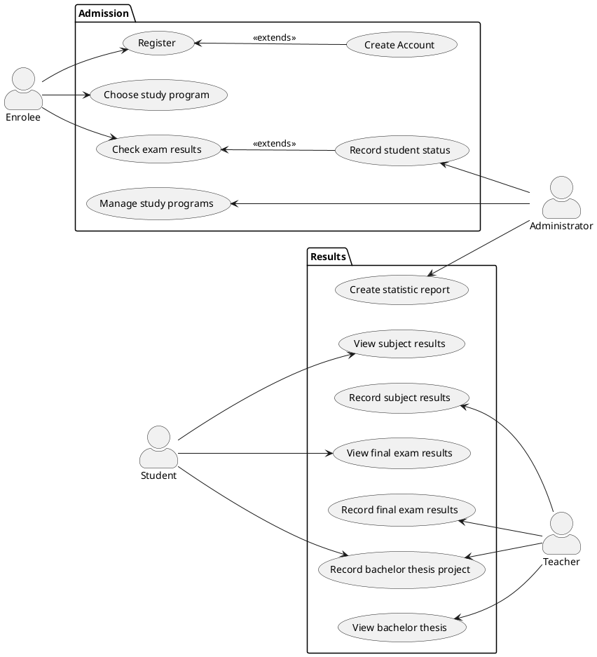

# Student information system - Students
  The Students Module handles admission into the university and grading of subjects, final exams and bachelor theses.

## Functional Requirements

### User requirements

1. A person shall be able to create a new application for the university and recieve credentials of his new account.
2. An enrolee should be able to choose his admision exam and study program.
3. An administartor shall be able to manage study programs.
4. An enrolee should be able to check the results of his admission exam.
5. A student should be able to accept or decline his place at the university.
6. An administartor should be able to record the status of the student at enrollment. 
7. An administartor should be able to create statistic reports.
8. A teacher shall be able to record the subject results of students. 
9. A student should be able to see his own results at a certain subject.
10. A teacher shall be able to record the results of the final exams taken by students.
11. A student shall be able see his result at the final exam.
12. A teacher shall be able to record the subject of the bachelor theses of students.
13. A student should be able to record his bachelor thesis project.
14. A teacher shall be able to view the bachelor theses of students.

### System requirements

#### Actors

##### Enrolee

  The Enrolee applies to the university and recieves credentials for his new account. Using the account, he can choose the study program he wants to apply for and recieves the date and place of the admission exam. After taking the exam, he will be able to view his results and choose whether to enroll to the university or to decline his place. 

##### Student

The Student can view his results at subjects and final exams given by teachers. He can also record his bachelor thesis project and view the grade for it which is recorded by another teacher.

##### Administrator

The Administartor manages the study programs of the university and records the status of a student (if he accepted/declined his place before/after the deadline). He creates statisticals reports on the student success rate in each year.

##### Teacher

The Teacher records the grading for his subjects and for the final exams taken by students. He can record the subject of the bachelor theses of the students he mentors and he can view their bachelor thesis projects.

#### Use cases

##### Register

###### Starting situation
  The enrolee wants to apply for a place at the university. He has filled out the form about his personal data and registers into the student management system.

###### Normal
1. The enrolee completes the form containing his personal information: first and last name, birth date, personal identification number, email, phone number and address.
2.  The Student Management System checks if all mandatory fields are filled in.
3. The Student Management System checks if the format of the personal idntification number, email and phone number are valid.
4. The form containing the personal data of the enrolee is submitted to the system.

###### What can go wrong
1. Not all the mandatory fields in the form are filled in by the enrolee. In this case, the enrolee must complete all of them.
2. The format of the filled in fields is not valid.In this case, the submitting of the form is rejected and the enrolee is notified and has to refill them correctly.

###### System state on completion
1. A valid form containg the personal data of the enrolee is submitted and registered in the system.
2. Non-valid filled forms are rejected and the enrolee is notified about the error.

##### Create Account

###### Starting situation
  The enrolee has registered his personal data into the system in order to create an account. 
   
###### Normal
1. The system recieves the data about an enrolee.
2. The system generates credentials for the new account according to the enrolee's personal data. The username is computed using the first and last name of the enrolee.
3. The Students Module registers the account with the given credentials ( username and initial password ) in the system.
4. The credentials of the new account are sent via email to the enrolee.
   
###### What can go wrong
1. If the generated username already exists ( for example there was another previous enrolee with the same name) the system adds a distinctive number to the username.

###### System state on completion
1. The enrolee recieves the credentials for his new account which was automatically generated by the system. 

##### Choose Study Program

###### Starting situation
  The enrolee logs into the account with the received credentials. In order to apply at the University, he must choose one of the available study programmes.  

###### Normal
1. Once logged in, the system provides a list of the faculties in the University.
2. The enrolee chooses the faculty he wants to apply to from the list.
3. The system displays the available study programmes from the selected faculty.
4. The enrolee chooses a study programme from the list.
5. After the enrolee submits the application, he will receive an email with the details about the exam.
   
###### What can go wrong
1. If the enrolee does not choose one of the options, he can't submit his application.

###### System state on completion
1. The application of the enrolee is registered.
   

##### Check Exam Results

###### Starting situation
  The enrolee logs into the account in order to check the results from the exam. Afterwards, he can choose if he wants to continue as a student of the University.

###### Normal
1. The enrolee logs in and the grade from the exam is displayed.
2. According to his grade and the filtering criteria, the administrator may offer him a place at the University.
3. If the enrolee receives a place at the University, he will be able to accept or decline his spot until the start of the first academic year.
4. If the enrolee accepts his place, then he will become a student at the chosen Faculty and be registered in the Student Information System.
5. If the enrolee does not receive a place at the University or if he declines his spot, after a period of time his account will be closed.

###### What can go wrong
1. If the accepted enrolee does not confirm his status until the deadline, his account will be closed.

###### System state on completion
1.  After the deadline, the enrolees that have accepted their spots are enroled as students at the University.

##### Record student status

###### Starting situation
  After the admission exams period ends, the administrator checks all the results and offers places at the university, based on the filtering criteria established by each faculty.

###### Normal
1. The administrator receives the reults from the admission exams.
2. The administrator filters all the enrolees, based on their grade and the number of free spots.
3. The administrator sends the offers to the enrolees that have received a spot at the University.

###### System state on completion
1. After the filtering process, each enrolee will receive an answer about his current status.

##### Manage Study Program

###### Starting situation
  When the University decides to modify a certain study programme or a course, the administrator will reflect the changes in the system.

###### Normal
1. The administrator receives the changes made by the University.
2. The administrator updates each study programme or course according to the given changes.
3. The administrator notifies the students enroled in the study programme or course to be changed, before the start of the semester.

###### What can go wrong
1. If the University decides to make some changes in the middle of the semester, they will be taken into consideration only in the next semester.

###### System state on completion
1.  The changes will be registered in the system.

##### Create Statistic Report

###### Starting situation
  After the exam session ends, the administrator creates a statistic report for each course.

###### Normal
1. The administrator has access to the final report of each student.
2. The administrator centralizes all the exam results from each course and places all of them in one file.
3. The administrator creates each course report based on the rate of success.

###### System state on completion
1.  Each course will receive a statistic report which will be displayed on the course's page.

##### View Subject Results

###### Starting situation
When students have added a subject, they must be able to follow how successful they are. 

###### Normal
1. Students logs in to his account.
2. Students should see a list of subjects they're enrolled in, primary for the current semester. Also, should be an option to filter results, for previous semesters.  
3. Students choose the subject and see a status. There should be 3 possible final states : 
-final grade - in case the subject is finished (doesn't matter how successful, it includes marks from 4 to 1);
-final status - in the case when the subject doesn't have a numeric mark. (Zapocet);
-in progress - when subjects are not finished yet.
 
###### What can go wrong
1. If students see other than enrolled subjects.
2. If students can edit results.

###### System state on completion
1. Students see a list of enrolled subjects and their status.

##### Record Subject Results
###### Starting situation
Teachers must be able to finish the course in a system. Usually, it means to grade his students and switch subject status from "in progress" to "finished". When the subject is finished it should be graded.

###### Normal
1. Teacher logs in to his account.
2. Teachers should see a list of subjects they're supervising in the current semester. 
3. Teachers choose the subject and edit a status. There should be 3 possible final states : 
-final grade - in case the subject is finished (doesn't matter how successful, it includes marks from 4 to 1);
-final status - in the case when the subject doesn't have a numeric mark. (Zapocet);
-in progress - when subjects are not finished yet.
4. Teachers see how many attempts students got.
 
###### What can go wrong
1. If teachers see other than supervised subjects.
2. If teachers cant edit results.

###### System state on completion
1. Teachers see a list of supervised subjects and their status.

##### View final exam results

###### Starting situation
  In the final year of a study programme, each student must take a final exam containg the most important subjects from his Faculty. He must be able to view his results from this exam.

###### Normal
1. Students logs into his account.
2. Students should see his final result in a separate section, which summarizes his progress during the study programme.  
3. If the grade is not high enough, the student must be notified to retake the exam.

###### System state on completion
1. Students see their result from the final exam.

##### Record final exam results

###### Starting situation
The teacher is able to grade the final exam taken by the students in their final year.

###### Normal
1. Teacher logs in to his account.
2. Teachers should see a list of the students that took the final exam and their work on it.
3. Teachers grade each final exam. There should be 2 possible final states : 
- passed -> if the student solved correctly more than 50% of the exam
- failed -> if the student did not attend the exam or did not get the minimum required points
4. Teachers make the grades publicly available.
 
###### What can go wrong
1. If teachers give grades that are not inbetween 1 and 4, they cannot submit the mark

###### System state on completion
1. All the final exam participants are graded by the teachers.

##### Record Bachelor Thesis Project
###### Starting situation
The teacher can add and edit a thesis for a bachelor's work.
The student can enroll himself in the project.

###### Normal
1. Teacher/Student logs in to his account.
2. Teachers/Students should see a list of the thesis. It can be a thesis from last year.
3. Teachers can add/edit/delete the thesis name, description.
4. Teachers can set restrictions on faculties.
5. Teachers can see the time, name, faculty of the enrolled student.
6. Teachers must have an option to approve or decline candidates. 
7. Teachers can set status, opponent, and graduation date.
8. Students must have an option to be enrolled in the project, if they pass faculty restrictions and if is a free spot for the project.

###### What can go wrong
1. If there are more than 1 enrolled student per thesis.
2. If teachers cant add/edit/delete thesis.
3. If students can add themselves to the project which is already full.
4. If students can add/edit/delete thesis.

###### System state on completion
1. Teachers and students can see the bachelor thesis they currently supervised/enrolled in with all additional information.

##### View Bachelor Thesis
###### Starting situation
The teacher can review submitted by student bachelor work.

###### Normal
1. Teacher should see the document, student information, and the date and time of the submission.
2. Teacher can add deadlines for submitting. 
3. Teacher cant edit the submitted document.
4. Teacher can approve or decline submitted work.

###### What can go wrong
1. If work were submitted after the deadline.
2. If students can edit date, time, deadlines. 

###### System state on completion
1. Teachers can review students' bachelor thesis projects.
