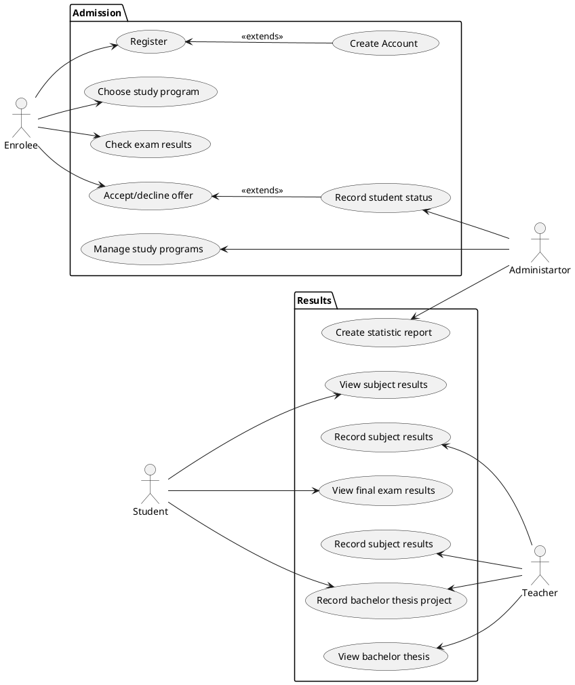

# Student information system - Students

## Functional Requirements

### User requirements

1. A person shall be able to create a new application for the university and recieve credentials of his new account.
2. An enrolee should be able to choose his admision exam and study program.
3. An administartor shall be able to manage study programs.
4. An enrolee should be able to check the results of his admission exam.
5. A student should be able to accept or decline his place at the university.
6. An administartor should be able to record the status of the student at enrollment. 
7. An administartor should be able to create statistic reports.
8. A teacher shall be able to record the subject results of students. 
9. A student should be able to see his own results at a certain subject.
10. A teacher shall be able to record the results of the final exams taken by students.
11. A student shall be able see his result at the final exam.
12. A teacher shall be able to record the subject of the bachelor theses of students.
13. A student should be able to record his bachelor thesis project.
14. A teacher shall be able to view the bachelor theses of students.

### System requirements

#### Actors

##### Enrolee

[*Actor description*]

##### Student

[*Actor description*]

##### Administartor

[*Actor description*]

##### Teacher

[*Actor description*]

#### Use cases

[*Document here all use cases. Create a subsection for each use case diagram. If you have only one use case diagram, you do not need a special subsection*]

[*Use case diagram in PlantUML*]

To be able to embed PlantUML diagrams to Markdown code with previews in VSCode you need
* Markdown All in One extension
* PlantUML extension
* Mardown Plantuml Preview extension

Follow https://plantuml.com/

[*Describe the diagram in a short paragraph. Describe each use case from the diaram in the detail from the lecture in a separate subsection.*]

##### [*Use case title*]

[*Use case description in the structure from the lecture.*]