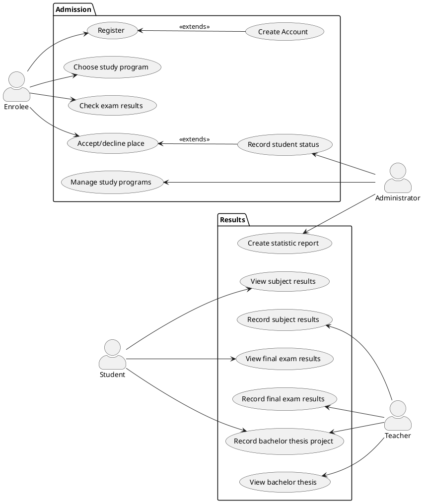

# Student information system - Students
  The Students Module handles admission into the university and grading of subjects, final exams and bachelor theses.

## Functional Requirements

### User requirements

1. A person shall be able to create a new application for the university and recieve credentials of his new account.
2. An enrolee should be able to choose his admision exam and study program.
3. An administartor shall be able to manage study programs.
4. An enrolee should be able to check the results of his admission exam.
5. A student should be able to accept or decline his place at the university.
6. An administartor should be able to record the status of the student at enrollment. 
7. An administartor should be able to create statistic reports.
8. A teacher shall be able to record the subject results of students. 
9. A student should be able to see his own results at a certain subject.
10. A teacher shall be able to record the results of the final exams taken by students.
11. A student shall be able see his result at the final exam.
12. A teacher shall be able to record the subject of the bachelor theses of students.
13. A student should be able to record his bachelor thesis project.
14. A teacher shall be able to view the bachelor theses of students.

### System requirements

#### Actors

##### Enrolee

  The Enrolee applies to the university and recieves credentials for his new account. Using the account, he can choose the study program he wants to apply for and recieves the date and place of the admission exam. After taking the exam, he will be able to view his results and choose whether to enroll to the university or to decline his place. 

##### Student

The Student can view his results at subjects and final exams given by teachers. He can also record his bachelor thesis project and view the grade for it which is recorded by another teacher.

##### Administrator

The Administartor manages the study programs of the university and records the status of a student (if he accepted/declined his place before/after the deadline). He creates statisticals reports on the student success rate in each year.

##### Teacher

The Teacher records the grading for his subjects and for the final exams taken by students. He can record the subject of the bachelor theses of the students he mentors and he can view their bachelor thesis projects.

#### Use cases

[*Document here all use cases. Create a subsection for each use case diagram. If you have only one use case diagram, you do not need a special subsection*]

[*Use case diagram in PlantUML*]

To be able to embed PlantUML diagrams to Markdown code with previews in VSCode you need
* Markdown All in One extension
* PlantUML extension
* Mardown Plantuml Preview extension

Follow https://plantuml.com/

[*Describe the diagram in a short paragraph. Describe each use case from the diaram in the detail from the lecture in a separate subsection.*]

##### Register

###### Starting situation
  The enrolee wants to apply for a place at the university. He has filled out the form about his personal data and registers into the student management system.

###### Normal
1. The enrolee completes the form containing his personal information: first and last name, birth date, personal identification number, email, phone number and address.
2.  The Student Management System checks if all mandatory fields are filled in.
3. The Student Management System checks if the format of the personal idntification number, email and phone number are valid.
4. The form containing the personal data of the enrolee is submitted to the system.

###### What can go wrong
1. Not all the mandatory fields in the form are filled in by the enrolee. In this case, the enrolee must complete all of them.
2. The format of the filled in fields is not valid.In this case, the submitting of the form is rejected and the enrolee is notified and has to refill them correctly.

###### System state on completion
1. A valid form containg the personal data of the enrolee is submitted and registered in the system.
2. Non-valid filled forms are rejected and the enrolee is notified about the error.

##### Create Account

###### Starting situation
  The enrolee has registered his personal data into the system in order to create an account. 
   
###### Normal
1. The system recieves the data about an enrolee.
2. The system generates credentials for the new account according to the enrolee's personal data. The username is computed using the first and last name of the enrolee.
3. The Students Module registers the account with the given credentials ( username and initial password ) in the system.
4. The credentials of the new account are sent via email to the enrolee.
   
###### What can go wrong
1. If the generated username already exists ( for example there was another previous enrolee with the same name) the system adds a distinctive number to the username.

###### System state on completion
1. The enrolee recieves the credentials for his new account which was automatically generated by the system. 

##### Choose Study Program
###### Starting situation
  The enrolee logs into the account with the received credentials. In order to apply at the University, he must choose one of the available study programmes.  
###### Normal
1. Once logged in, the system provides a list of the faculties in the University.
2. The enrolee chooses the faculty he wants to apply to from the list.
3. The system displays the available study programmes from the selected faculty.
4. The enrolee chooses a study programme from the list.
5. After the enrolee submits the application, he will receive an email with the details about the exam.
   
###### What can go wrong
1. If the enrolee does not choose one of the options, he can't submit his application.

###### System state on completion
1. The application of the enrolee is registered.
   
##### Check Exam Results
###### Starting situation
  The enrolee logs into the account in order to check the results from the exam. Afterwards, he can choose if he wants to continue as a student of the University.
###### Normal
1. The enrolee logs in and the grade from the exam is displayed.
2. According to his grade and the filtering criteria, the administrator may offer him a place at the University.
3. If the enrolee receives a place at the University, he will be able to accept or decline his spot.
   
###### What can go wrong
1. If the generated username already exists ( for example there was another previous enrolee with the same name) the system adds a distinctive number to the username.

###### System state on completion
1. The enrolee recieves the credentials for his new account which was automatically generated by the system. 

##### Accept/Decline Place

##### Record student status

##### Manage Study Program

##### Create Statistic Report

##### View Subject Results

##### Record Subject Results

##### Record Bachelor Thesis Project

##### View Bachelor Thesis

[*Use case description in the structure from the lecture.*]